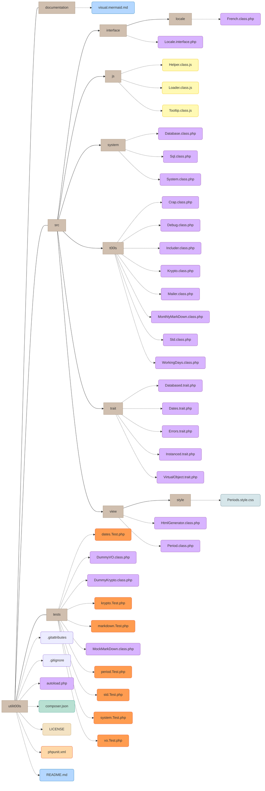

```mermaid
graph LR
    utilit00ls --- documentation
        documentation -.-> visual["visual.mermaid.md"]
    utilit00ls --- src
        src --> interface
            interface --> locale
                locale -.-> French["French.class.php"]
            interface -.-> Locale["Locale.interface.php"]
        src --> js
            js -.-> Helper["Helper.class.js"]
            js -.-> Loader["Loader.class.js"]
            js -.-> Tooltip["Tooltip.class.js"]
        src --> system
            system -.-> Database["Database.class.php"]
            system -.-> Sql["Sql.class.php"]
            system -.-> SystemClass["System.class.php"]
        src --> t00ls
            t00ls -.-> Crap["Crap.class.php"]
            t00ls -.-> Debug["Debug.class.php"]
            t00ls -.-> Includer["Includer.class.php"]
            t00ls -.-> krypto["Krypto.class.php"]
            t00ls -.-> Mailer["Mailer.class.php"]
            t00ls -.-> MonthlyMarkDown["MonthlyMarkDown.class.php"]
            t00ls -.-> Std["Std.class.php"]
            t00ls -.-> WorkingDays["WorkingDays.class.php"]
        src --> trait
            trait -.-> Databased["Databased.trait.php"]
            trait -.-> Dates["Dates.trait.php"]
            trait -.-> Errors["Errors.trait.php"]
            trait -.-> Instanced["Instanced.trait.php"]
            trait -.-> VirtualObject["VirtualObject.trait.php"]
        src --> view
            view --> css["style"]
                css -.-> cssPeriods["Periods.style.css"]
            view -.-> HtmlGenerator["HtmlGenerator.class.php"]
            view -.-> Period["Period.class.php"]
    utilit00ls --- tests
        tests -.-> t_dates["dates.Test.php"]
        tests -.-> dummyvo["DummyVO.class.php"]
        tests -.-> dummykrypto["DummyKrypto.class.php"]
        tests -.-> t_krypto["krypto.Test.php"]
        tests -.-> t_markdown["markdown.Test.php"]
        tests -.-> mockmarkdown["MockMarkDown.class.php"]
        tests -.-> t_period["period.Test.php"]
        tests -.-> t_std["std.Test.php"]
        tests -.-> t_system["system.Test.php"]
        tests -.-> t_vo["vo.Test.php"]
    utilit00ls -.-> gitattributes[".gitattributes"]
    utilit00ls -.-> gitignore[".gitignore"]
    utilit00ls -.-> fautoload["autoload.php"]
    utilit00ls -.-> composer["composer.json"]
    utilit00ls -.-> license["LICENSE"]
    utilit00ls -.-> unit["phpunit.xml"]
    utilit00ls -.-> readme["README.md"]

    classDef php fill:#D8B4FF,stroke:#9B59B6,stroke-width:1px,rx:6px,ry:6px;

    classDef js fill:#FFF9B4,stroke:#F1C40F,stroke-width:1px,rx:6px,ry:6px;

    classDef folder fill:#D0BFAF,stroke:#A38F78,stroke-width:1px;

    classDef json fill:#B8E0D2,stroke:#48A999,stroke-width:1px,rx:6px,ry:6px;

    classDef md fill:#B4D7FF,stroke:#2E86C1,stroke-width:1px,rx:6px,ry:6px;

    classDef licensed fill:#F4E3C3,stroke:#C9A66B,stroke-width:1px,rx:6px,ry:6px;

    classDef basics rx:6px,ry:6px;

    classDef tested fill:#ff9c50,stroke:#E5532B,stroke-width:1px,rx:6px,ry:6px;

    classDef united fill:#ffd8a8,stroke:#E5532B,stroke-width:1px,rx:6px,ry:6px;

    classDef css fill:#D6E6EA,stroke:#6B8A94,stroke-width:1px,rx:6px,ry:6px;

    class src,js,system,t00ls,trait,view,utilit00ls,documentation,tests,css,interface,locale folder;

    class Database,Sql,SystemClass,Crap,Debug,Includer,Mailer,MonthlyMarkDown,Std,WorkingDays,Databased,Dates,Errors,VirtualObject,HtmlGenerator,krypto,dummyvo,dummykrypto,mockmarkdown,fautoload,Period,Instanced,Locale,French php;

    class Helper,Loader,Tooltip js;

    class composer json;

    class license licensed;

    class readme,visual md;

    class gitignore,gitattributes basics;

    class unit united;

    class t_std,t_vo,t_system,t_krypto,t_markdown,t_dates,t_period tested;

    class cssPeriods css;
```